# Máquina: Wgel CTF

**Tryhackme: Wgel CTF

# NMAP

Lanzamos el comando de reconocimiento y sacamos la siguiente información:

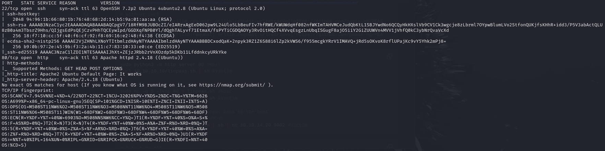

Como se observa en las imágenes anteriores, existen 3 servicios que nos pueden interesar:

- Puerto 22 (SSH)
- Puerto 80 (HTTP)

# Enumeración: Puerto 80

Accedemos a la página web que nos ofrece la máquina objetivo. Una vez dentro, veremos algo que no nos encaja del todo:

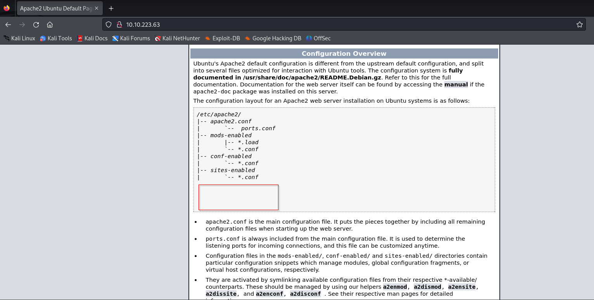

Parece ser que la página no está completa del todo, ya que faltaría un trozo de texto. Por lo tanto, vamos a acceder al código fuente de la página para ver si encontramos información adicional.

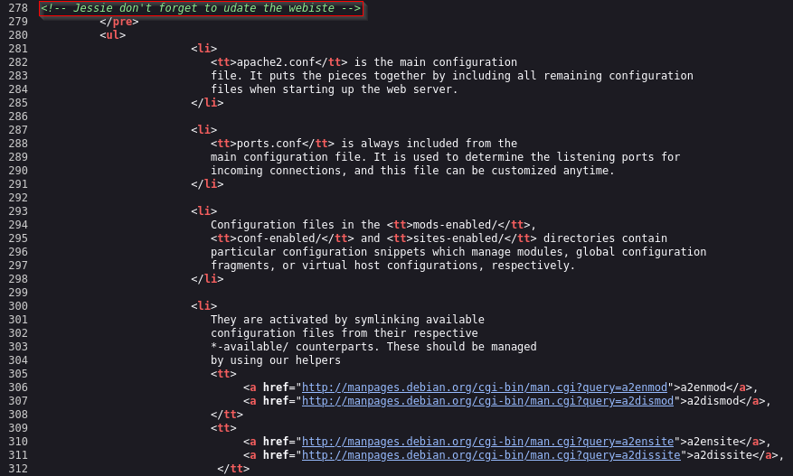

Como se observa en la imagen anterior, alguien le dejó un comentario a Jessie (Este posiblemente sea un usuario del sistema), al cual parece ser que se le olvidó actualizar la página web.

# Fuzzing con Ffuf

A continuación, realizaremos fuzzing con ffuf. Para ello, utilizaremos el siguiente comando:

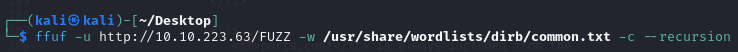

Observando la salida del comando, habrá un directorio que nos llamará especialmente la atención:

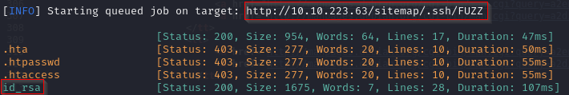

Ahora lo que vamos a hacer, es acceder a ese directorio y nos vamos a descargar esa clave que hemos encontrado.

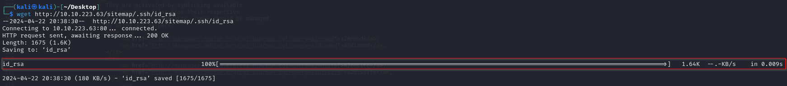

# Explotación: Puerto 22

A continuación, vamos a utilizar "ssh2jhon" para comprobar si existe alguna contraseña adherida a la clave que nos hemos encontrado.

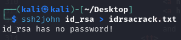

Genial, como no hay ninguna contraseña adherida a la clave, vamos a utilizarla para acceder por SSH a la máquina objetivo:

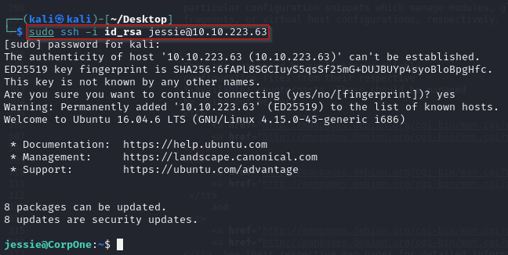

# Flag usuario.txt

Para encontrar la flag del usuario, tendremos que acceder a la carpeta "Documents" y listar su contenido. Una vez lo hayamos hecho, veremos que la flag se encuentra en dicho directorio. Por último, realizaremos un "cat" y visualizaremos el contenido de la flag.

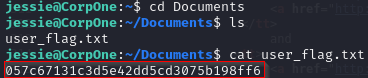

# Flag root.txt

Para obtener la flag del usuario root, tendremos que elevar nuestros privilegios en la máquina objetivo. Para ello, realizaremos primeramente un "sudo -l" para ver qué comandos puede ejecutar el usuario jessie como administrador.

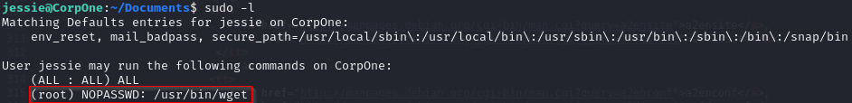

Como podemos observar en la imagen anterior, jessie tiene permisos para ejecutar el comando "wget" como administrador.

Ahora usaremos "wget" para transferir el contenido de "/etc/passwd" a nuestra máquina local, luego crearemos un nuevo fichero "passwd" y lo transferiremos de nuevo a la máquina objetivo.

## Nos traemos el fichero "/etc/passwd"

Ponemos a escuchar a nuestra máquina local con "nc":

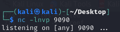

Nos traemos el "/etc/passwd" utilizando el método POST:

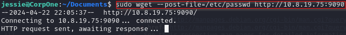

Miramos que nuestra Kali haya recibido el fichero "passwd":

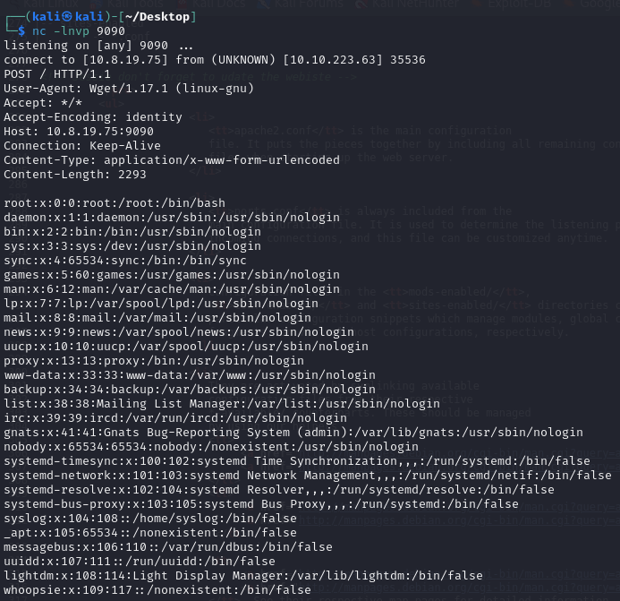

Ahora lo que haremos, será copiar el contenido en un nuevo archivo y vamos a modificar la parte de la contraseña del usuario root.

Es decir, cambiaremos la "x" por una contraseña cualquiera. Una vez establezcamos la nueva contraseña, el "/etc/passwd" no buscará el archivo "/etc/shadow" para la contraseña del usuario root.

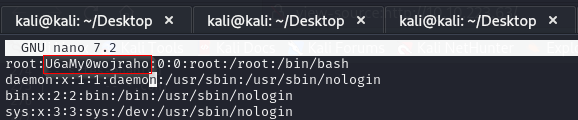

Ahora crearemos un "Simple HTTP Server" con Python3 para poder mandar el fichero modificado a la máquina objetivo.

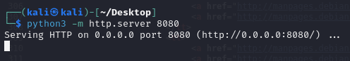

Nos vamos a la máquina objetivo y nos descargamos el fichero.

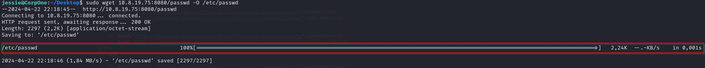

Visualizamos el fichero "/etc/passwd" para ver si se ha realizado el cambio.

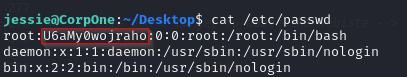

A continuación, vamos a tratar de acceder como usuario root, en principio no deberíamos de introducir ningún tipo de contraseña.

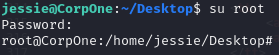

Como vemos en la imagen anterior, ya seríamos usuario root.

Ahora para encontrar la flag, nos iríamos a la ruta "/root" y listaríamos el contenido de la carpeta. Una vez listada, veremos que la flag está dentro de dicho directorio. Realizamos un "cat" y veremos la flag de root.
